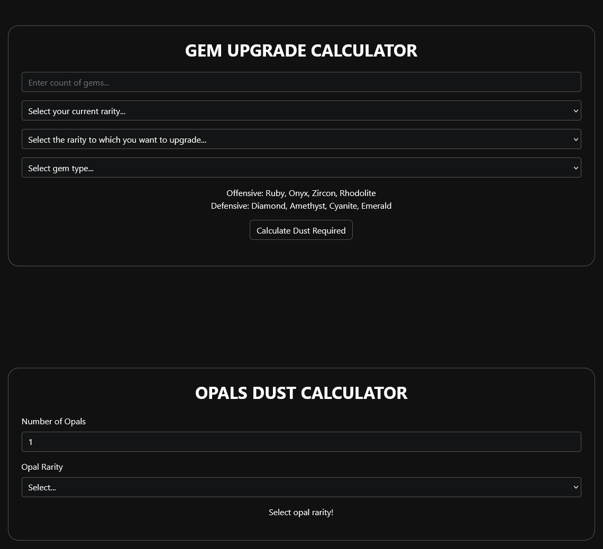

# DSO Gems Calculator



The **DSO Calculator** is a web-based tool designed to help users easily calculate the dust required for gem upgrades and opal dust calculations. This tool is particularly useful for players who need to understand the resources needed to upgrade their gems and opals effectively.

---

## Table of Contents
1. [Features](#features)
2. [Technologies Used](#technologies-used)
3. [Getting Started](#getting-started)
4. [Installation](#installation)
5. [Usage](#usage)

---

## Features

- **Gem Upgrade Calculator**: Calculates the dust required for upgrading different gems.
- **Opals Dust Calculator**: Calculates the dust required for upgrading opals based on the selected quantity and rarity.
- **Interactive Form**: Users can input their gem or opal details and get real-time dust calculations.
- **Responsive Design**: Built with Bootstrap for mobile-friendly usage.

---

## Technologies Used

- **HTML5**: Markup language for creating the structure of the app.
- **CSS3**: Styling for the layout and color schemes.
- **JavaScript (jQuery)**: To handle the logic for calculating dust values dynamically.
- **Bootstrap 4**: For a responsive and structured layout.
- **Custom CSS**: For scrollbar customization and input fields.

---

## Getting Started

To use this application, you can simply open the `index.html` file in a browser.

Alternatively, you can host this project on a local server for development purposes.

### Prerequisites

This application requires no external dependencies to run but recommends using a modern browser for best compatibility.

---

## Installation

1. Clone this repository:
    ```bash
    git clone https://github.com/your-username/dso-calculator.git
    ```

2. Navigate to the project directory:
    ```bash
    cd dso-calculator
    ```

3. Open `index.html` in your browser:
    ```bash
    open index.html
    ```

## Usage

1. **Gem Upgrade Calculation**:
   - Input the number of gems.
   - Select your current gem rarity and target upgrade rarity.
   - Choose the gem type (Offensive or Defensive).
   - Click on **Calculate Dust Required** to see the result.

2. **Opal Dust Calculation**:
   - Enter the number of opals.
   - Select the opal rarity.
   - The dust required will display below.

3. **Opal and Gem Types**:
   - Offensive gems include Ruby, Onyx, Zircon, and Rhodolite.
   - Defensive gems include Diamond, Amethyst, Cyanite, and Emerald.
